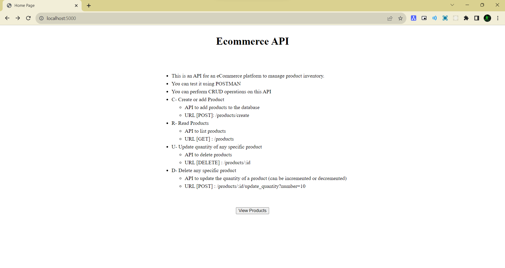
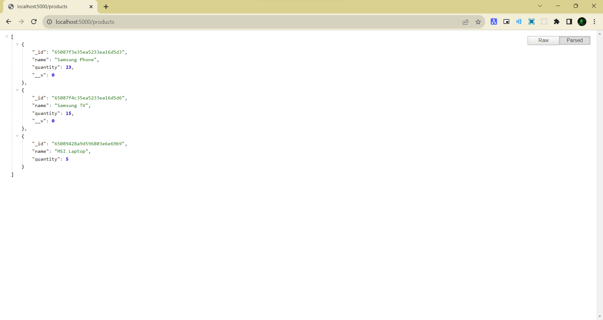

<h1 align="center">Ecommerce API</h1> 

 🖊️ This is an API for an eCommerce platform to manage product inventory.  
     This App built using <a href="https://ejs.co/">EJS</a>, <a href="https://www.mongodb.com/">MongoDB</a>, <a href="https://expressjs.com/">ExpressJs</a> and <a href="https://nodejs.org/en/">NodeJs</a>

## Table of contents

-   [Features](#Features)
-   [Folder Structure](#Folder-Structure)
-   [Screenshot](#Screenshots)
-   [Built with](#built-with)
-   [Author](#author)
-   [Setup](#Setup)
-   [Run](#Run)
-   [Deploy Link](#deployed-link)

## Features

<ul>
  <li>You can perform CRUD operations on this API</li>
  <li>C- Create or add Product</li>
  <ul>
      <li>API to add products to the database</li>
      <li>URL [POST]: /products/create</li>
   </ul>
  <li>R- Read Products</li>
   <ul>
      <li>API to list products</li>
      <li>URL [GET] : /products</li>
  </ul>
   <li>U- Update quantity of any specific product</li>
  <ul>
      <li>API to delete products</li>
      <li>URL [DELETE] : /products/:id</li>
   </ul>
            <li>D- Delete any specific product</li>
   <ul>
       <li>API to update the quantity of a product (can be incremented or decremented)</li>
       <li>URL [POST] : /products/:id/update_quantity?number=10</li>
   </ul>
</ul>

## Folder Structure

-   Ecommerce API
    -   config
        -   mongoose.js
    -   controller
        -   home_controller.js
        -   product_controller.js
    -   models
        -   product.js
    -   routes
        -   index.js
        -   product.js
    -   views
        -   home.ejs
    -   index.js
    -   package-lock.json
    -   package.json

## Screenshots

-   Home Page
      

-   Products
      

## Built with

-   NodeJs
-   ExpressJs
-   MongoDB
-   EJS

## Author

-   Github - [Subha Biswal](https://github.com/20SB)

## Setup

Run `npm install` to install required dependencies

## Run

Run `npm start`, open localhost:5000 in browser to run the program

## Deployed Link

-[Ecommerce API](https://ecommerce-api-lxkr.onrender.com)

## Test Usage

You can use an API testing tool like Postman to interact with the eCommerce API.

-   Create a product:

    -   Endpoint: POST /products/create

-   Get products:

    -   Endpoint: GET /products

-   Delete a product:

    -   Endpoint: DELETE /products/:id

-   Update a product:
    -   Endpoint: POST /products/:id/update_quantity/?number=10
